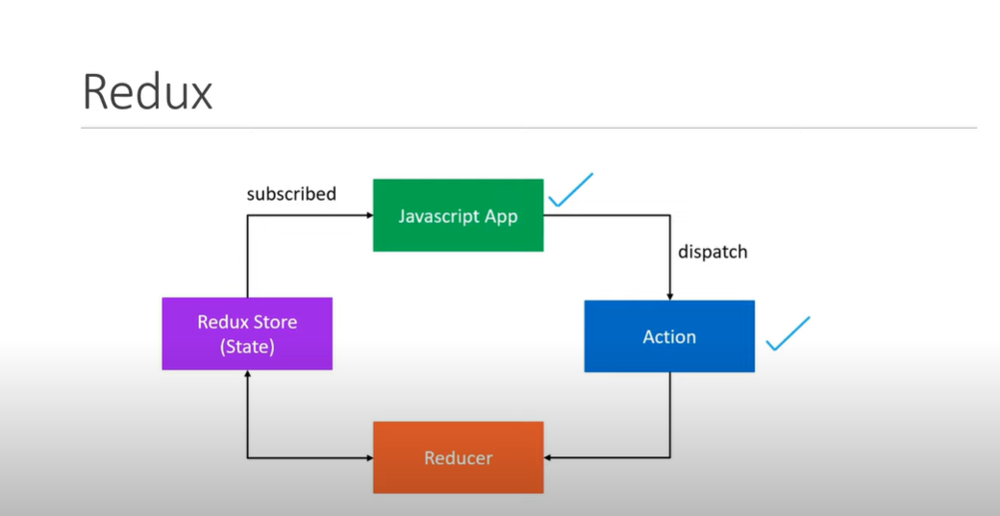
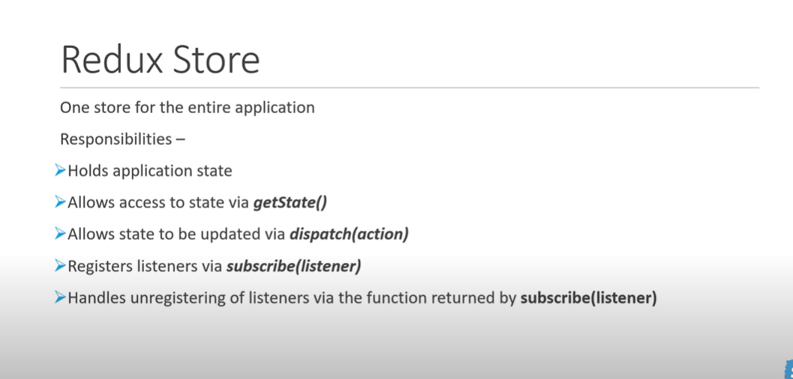

1. createStore
2. Subscribe to the Store.
`subscribre(listener)`
3. Access state using `getState()`
4. Can Update using `dispacth(action)`
5. unsubscribe from store

Note: `As the app grows- we will be using mutliple reducers and combine them`